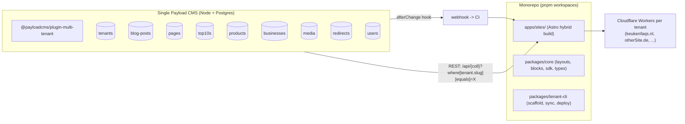

## 1. Target Architecture



- One Payload CMS, multi-tenant scoped via [@payloadcms/plugin-multi-tenant](https://payloadcms.com/docs/plugins/multi-tenant).
- One monorepo. Each tenant is a standalone Astro project (essentially today's [keukenfaqs-main](keukenfaqs-main) shape) that imports a shared `@org/core` package.
- Build-time content sync: each tenant fetches its slice of Payload via REST and writes JSON/MD into local content collections, then runs the existing `astro:content` pipeline (same as today). Hybrid mode allows one or two SSR routes per tenant (contact form, search).
- Payload `afterChange` hooks call a webhook that triggers a rebuild for only the affected tenant.

## 2. Recommended Stack

- **Payload v3** (Next.js host) — current LTS, ships REST/GraphQL + Local API + Lexical rich text.
- **Postgres on Neon** — serverless, scales to 1000 tenants × ~2.7k pages = ~2.7M rows, transactional, JSONB for content blocks. Better fit than MongoDB for the multi-tenant plugin's relational queries at this scale.
- **Payload host: Fly.io** (or Railway) — Node container, cheap, easy region pinning, scales horizontally.
- **Media storage: Cloudflare R2** via `@payloadcms/storage-s3` adapter — same provider as the sites, no egress cost, S3 API.
- **Frontends: Cloudflare Workers** (one per tenant) — keep current Wrangler-based deploy in [keukenfaqs-main/wrangler.jsonc](keukenfaqs-main/wrangler.jsonc).
- **Monorepo tooling: pnpm + turbo** for caching builds across tenants.

## 3. Repo Layout (proposed)

```
astropayload/
├── apps/
│   ├── payload/                  # Payload v3 Next.js app
│   └── sites/
│       ├── keukenfaqs/           # first tenant (refactor of keukenfaqs-main)
│       └── <future tenants>/
├── packages/
│   ├── core/                     # shared layouts/components/blocks
│   ├── payload-sdk/              # typed REST client + content-sync helpers
│   ├── tenant-cli/               # scaffold, sync, deploy, webhook receiver
│   └── eslint-config/
├── pnpm-workspace.yaml
├── turbo.json
└── package.json
```

## 4. Payload CMS — Collections & Multi-Tenant Plugin

Configure in `apps/payload/src/payload.config.ts`:

```ts
import { multiTenantPlugin } from '@payloadcms/plugin-multi-tenant'

multiTenantPlugin({
  collections: {
    'blog-posts': {},
    pages: {},
    top10s: {},
    products: {},
    businesses: {},
    media: {},
    redirects: {},
    'nav-menus': {},
  },
  tenantField: { name: 'tenant' },
  userHasAccessToAllTenants: (user) => user.roles?.includes('super-admin'),
})
```

Collections (each automatically gets a `tenant` relationship from the plugin):

- `tenants` — `{ name, slug, domain, locale, themeTokens (colors/fonts), gaId, socialLinks, affiliateConfig (bolPublisherId, awinId), seoDefaults }`.
- `blog-posts` — mirrors today's [src/content.config.ts](keukenfaqs-main/src/content.config.ts) `blog` schema: title, slug, description, pubDate, updatedDate, heroImage (media rel), content (Lexical), categories[], tags[], author.
- `pages` — title, slug, description, pubDate, content (Lexical).
- `top10s` — title, slug, h1, intro, conclusion, products[] (rank, name, image, description, affiliate_url, affiliate_network), faq[] (question, answer_html), seo block.
- `products` — name, slug, category, intro, rating, image, affiliate_url/network/cta, specs[], description, pros[], cons[], seo block.
- `businesses` — name, slug, city, address, website_url, google_maps_url, intro, seo block.
- `media` — uploads via S3 adapter -> R2; tenant-scoped.
- `redirects` — `from`, `to`, `status` (covers the 27 dropped URLs from [AUDIT.md §9](keukenfaqs-main/AUDIT.md) and future WP migrations).
- `nav-menus` — header/footer link structures matching [SiteHeader.astro](keukenfaqs-main/src/components/SiteHeader.astro).
- `users` — Payload's built-in, with `roles[]` and tenant access lists.

Tenant field auto-injected by the plugin; access control ensures editors only see their own tenant's data and the admin UI gets a tenant switcher.

## 5. Tenant Template — Refactor of keukenfaqs-main

Move [keukenfaqs-main](keukenfaqs-main) into `apps/sites/keukenfaqs/`. Changes:

- **Site identity becomes config-driven.** Replace hardcoded values in [astro.config.mjs](keukenfaqs-main/astro.config.mjs) (`site: 'https://keukenfaqs.nl'`), [src/consts.ts](keukenfaqs-main/src/consts.ts) (`SITE_TITLE`, `SITE_DESCRIPTION`), and the GA4 ID in [BaseLayout.astro](keukenfaqs-main/src/layouts/BaseLayout.astro) (`G-43H5NMZVHK`) with values loaded from a generated `tenant.config.json` (synced from Payload) + env vars.
- **Theme tokens** (navy/coral palette, Inter font) move to `tenant.config.json -> themeTokens` and are emitted as CSS variables in [src/styles/global.css](keukenfaqs-main/src/styles/global.css). Tenants override these by editing their Payload `tenants` record.
- **Layouts + components stay per-tenant** ([BaseLayout.astro](keukenfaqs-main/src/layouts/BaseLayout.astro), [TopTenLayout.astro](keukenfaqs-main/src/layouts/TopTenLayout.astro), [SiteHeader.astro](keukenfaqs-main/src/components/SiteHeader.astro), etc.). Shared building blocks (Image, Breadcrumb, JsonLd helper) lift to `packages/core`.
- **Wrangler** ([wrangler.jsonc](keukenfaqs-main/wrangler.jsonc)) keeps its current shape; one Wrangler project per tenant, named after the tenant slug.
- **Astro hybrid output**: switch to `output: 'server'` with `@astrojs/cloudflare` adapter so per-tenant SSR routes (contact form POST, on-demand OG images) are possible while everything else is prerendered.

## 6. Content Sync (Build-Time)

New `packages/payload-sdk` provides a typed REST client. Add a `sync:content` script that runs before `astro build`:

```ts
const tenant = process.env.TENANT
const sdk = createPayloadSdk({ url: env.PAYLOAD_URL, apiKey: env.PAYLOAD_API_KEY, tenant })

await Promise.all([
  sdk.exportTo('blog-posts',  'src/content/blog',          formatBlogMarkdown),
  sdk.exportTo('pages',       'src/content/pages',         formatPageMarkdown),
  sdk.exportTo('top10s',      'src/data/money-pages/top10',    formatTop10Json),
  sdk.exportTo('products',    'src/data/money-pages/product',  formatProductJson),
  sdk.exportTo('businesses',  'src/data/money-pages/business', formatBusinessJson),
])
```

This emits files in the exact shape today's [src/content.config.ts](keukenfaqs-main/src/content.config.ts) already expects — so `getCollection()`, `[...slug].astro`, and every layout work unchanged. We are reusing the existing static pipeline; Payload just replaces the WXR import as the source of truth.

## 7. WordPress -> Payload Migration

The existing [migration/import-wxr.mjs](keukenfaqs-main/migration/import-wxr.mjs) and [migration/scrape-money-pages.mjs](keukenfaqs-main/migration/scrape-money-pages.mjs) already produce normalized intermediates. Rework them so the **target is Payload's Local/REST API** instead of the filesystem:

- Run inside `apps/payload` using the Local API for speed.
- For each WP site to migrate: create a `tenants` record (slug, domain, theme tokens, GA4 id, affiliate config), then upsert posts/pages/top10s/products/businesses/media scoped to that tenant.
- Reuse the existing turndown + html parsing logic; map images via R2 upload.
- Migrate [migration/dropped-urls.txt](keukenfaqs-main/migration/dropped-urls.txt) into `redirects`.

This lets us onboard new WordPress sites with one CLI command: `pnpm tenant-cli migrate --wxr ./export.xml --slug new-site --domain new-site.com`.

## 8. CI/CD — Per-Tenant Rebuild on Publish

- Payload `afterChange` hook on every content collection POSTs `{ tenantSlug, collection, id }` to a GitHub Actions / Cloudflare Worker webhook.
- Webhook dispatches a `workflow_dispatch` event scoped to the affected tenant.
- Workflow runs:
  ```
  pnpm --filter @sites/<slug> sync:content
  pnpm --filter @sites/<slug> build
  pnpm --filter @sites/<slug> deploy   # wrangler deploy
  ```
- Turbo caches builds across tenants; only the affected tenant rebuilds (~30s–3min per site depending on page count).

## 9. Scaling Considerations (100–1000 tenants)

- **Build farm**: a tenant with 2.7k money pages builds in ~2–5 minutes today on Astro 6. 1000 such sites = ~50–80 build-hours total, but rebuilds are per-tenant and incremental — no need to rebuild all at once.
- **DB indexes**: composite indexes on `(tenant, slug)` for every collection; the multi-tenant plugin scopes queries automatically but we add the indexes explicitly.
- **Payload admin**: enable tenant switcher; restrict editor roles to specific tenants via the plugin's access control.
- **Media**: bucket-per-tenant prefix in R2 (`tenants/<slug>/...`) to keep URLs clean and quotas easy.
- **Cloudflare account limits**: free tier allows 500 Workers per account. For >500 sites, plan for the Workers Paid plan (unlimited) or multi-account sharding.

## 10. Open Items Worth Confirming Before Build

- **Monorepo vs per-tenant separate repos**: I'm proposing monorepo. Confirm or push back.
- **Postgres on Neon vs Mongo Atlas**: I'm recommending Postgres for the relational multi-tenant query shape. Easy to swap before any data exists.
- **Payload v3 vs v2**: v3 is current; assumed throughout.
- **Theme tokens scope**: how much per-tenant customization should be data (colors, nav, fonts, copy) vs code (layouts, new page types). Default assumption: anything that doesn't require a new component goes into Payload `tenants.themeTokens`; anything that does is code in the tenant's app folder.